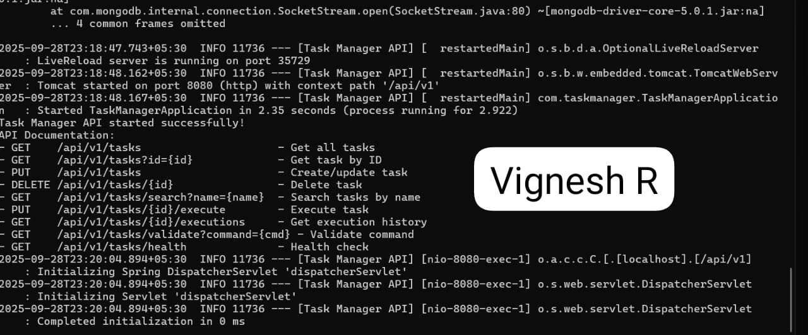
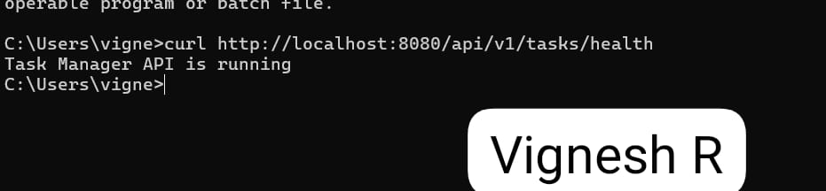

# Task Manager REST API

A Spring Boot application that provides a REST API for managing and executing shell command tasks with MongoDB storage.

## Features

- **CRUD Operations**: Create, Read, Update, Delete tasks
- **Task Execution**: Execute shell commands safely with execution history
- **Security**: Command validation to prevent malicious operations
- **Search**: Find tasks by name patterns
- **MongoDB Integration**: Persistent storage for tasks and execution history
- **Error Handling**: Comprehensive error handling with meaningful responses


## Project Structure
```

task-manager-api/
├── src/main/java/com/taskmanager/
│   ├── TaskManagerApplication.java      # Main application
│   ├── controller/
│   │   └── TaskController.java          # REST endpoints
│   ├── service/
│   │   ├── TaskService.java             # Service interface
│   │   └── TaskServiceImpl.java         # Business logic
│   ├── model/
│   │   ├── Task.java                    # Task entity
│   │   └── TaskExecution.java           # Execution record
│   ├── repository/
│   │   └── TaskRepository.java          # MongoDB repository
│   ├── dto/
│   │   ├── TaskCreateRequest.java       # Request DTOs
│   │   └── TaskExecutionRequest.java
│   ├── exception/
│   │   ├── TaskNotFoundException.java   # Custom exceptions
│   │   └── GlobalExceptionHandler.java
│   └── util/
│       └── CommandValidator.java        # Security validation
└── src/main/resources/
    └── application.properties           # Configuration
```


## Prerequisites

Before running the application, ensure you have:

1. **Java 17 or higher** installed
2. **Maven 3.6+** installed
3. **MongoDB** installed and running on localhost:27017

### MongoDB Setup

1. Install MongoDB from [https://www.mongodb.com/try/download/community](https://www.mongodb.com/try/download/community)
2. Start MongoDB service:
   ```bash
   # On Windows
   mongod
   
   # On macOS (with Homebrew)
   brew services start mongodb/brew/mongodb-community
   
   # On Linux
   sudo systemctl start mongod
   ```
3. The application will automatically create the `taskmanager` database

## How to Run the Application

1. **Clone or create the project** with the provided directory structure
2. **Navigate to the project root** directory
3. **Build the application**:
   ```bash
   mvn clean compile
   ```
4. **Run the application**:
   ```bash
   mvn spring-boot:run
   ```

The application will start on `http://localhost:8080/api/v1`

## API Endpoints

### Base URL: `http://localhost:8080/api/v1`

### 1. Get All Tasks
```http
GET /tasks
```
**Response**: Array of all tasks

### 2. Get Task by ID
```http
GET /tasks?id={taskId}
```
**Response**: Single task or 404 if not found

### 3. Create/Update Task
```http
PUT /tasks
Content-Type: application/json

{
    "id": "123",
    "name": "Print Hello",
    "owner": "John Smith",
    "command": "echo Hello World"
}
```
**Response**: Created/updated task

### 4. Delete Task
```http
DELETE /tasks/{taskId}
```
**Response**: Success message or 404 if not found

### 5. Search Tasks by Name
```http
GET /tasks/search?name={searchString}
```
**Response**: Array of matching tasks or 404 if none found

### 6. Execute Task
```http
PUT /tasks/{taskId}/execute
```
**Response**: Task execution result with timing and output

### 7. Get Execution History
```http
GET /tasks/{taskId}/executions
```
**Response**: Array of all executions for the task

### 8. Validate Command (Utility)
```http
GET /tasks/validate?command={command}
```
**Response**: Validation result

### 9. Health Check
```http
GET /tasks/health
```
**Response**: API status

## Testing with Postman

### 1. Create a Task
- **Method**: PUT
- **URL**: `http://localhost:8080/api/v1/tasks`
- **Headers**: `Content-Type: application/json`
- **Body** (JSON):
```json
{
    "id": "task-001",
    "name": "List Files",
    "owner": "John Doe",
    "command": "ls -la"
}
```

### 2. Get All Tasks
- **Method**: GET
- **URL**: `http://localhost:8080/api/v1/tasks`

### 3. Execute a Task
- **Method**: PUT
- **URL**: `http://localhost:8080/api/v1/tasks/task-001/execute`

### 4. Search Tasks
- **Method**: GET
- **URL**: `http://localhost:8080/api/v1/tasks/search?name=List`

## Testing with cURL

### Create a Task
```bash
curl -X PUT http://localhost:8080/api/v1/tasks \
  -H "Content-Type: application/json" \
  -d '{
    "id": "task-002",
    "name": "Print Date",
    "owner": "Jane Smith",
    "command": "date"
  }'
```

### Get All Tasks
```bash
curl http://localhost:8080/api/v1/tasks
```

### Execute a Task
```bash
curl -X PUT http://localhost:8080/api/v1/tasks/task-002/execute
```

## Safe Commands Examples

The application only allows safe commands. Here are some examples:

✅ **Allowed Commands:**
- `echo Hello World`
- `date`
- `pwd`
- `ls`
- `whoami`
- `cat filename.txt`
- `sleep 5`

❌ **Blocked Commands:**
- `rm -rf /`
- `sudo anything`
- `wget http://malicious.com`
- Commands with pipes `|`, redirects `>`, or other dangerous patterns


## Error Handling

The API provides consistent error responses:

### 404 Not Found
```json
{
    "timestamp": "2023-04-21T15:30:00",
    "status": 404,
    "error": "Not Found",
    "message": "Task with ID 'invalid-id' not found",
    "path": "uri=/api/v1/tasks"
}
```

### 400 Bad Request (Validation Error)
```json
{
    "timestamp": "2023-04-21T15:30:00",
    "status": 400,
    "error": "Validation Failed",
    "message": "Invalid input provided",
    "validationErrors": {
        "name": "Task name is required"
    }
}
```

## Security Features

1. **Command Validation**: Prevents execution of dangerous commands
2. **Input Validation**: Validates all request parameters
3. **Timeout Protection**: Commands timeout after 30 seconds
4. **Error Sanitization**: Prevents information leakage

## MongoDB Collections

### Tasks Collection Structure
```json
{
    "_id": "task-001",
    "name": "Print Hello",
    "owner": "John Smith",
    "command": "echo Hello World",
    "taskExecutions": [
        {
            "startTime": "2023-04-21T15:51:42.276Z",
            "endTime": "2023-04-21T15:51:43.276Z",
            "output": "Hello World\n"
        }
    ]
}
```

## OUTPUT SCREENSHOTS




## Troubleshooting

### Common Issues

1. **MongoDB Connection Error**
   - Ensure MongoDB is running on localhost:27017
   - Check MongoDB service status

2. **Port Already in Use**
   - Change port in `application.properties`: `server.port=8081`

3. **Command Execution Fails**
   - Verify the command is in the safe commands list
   - Check OS compatibility (Windows vs Linux/macOS)
---
